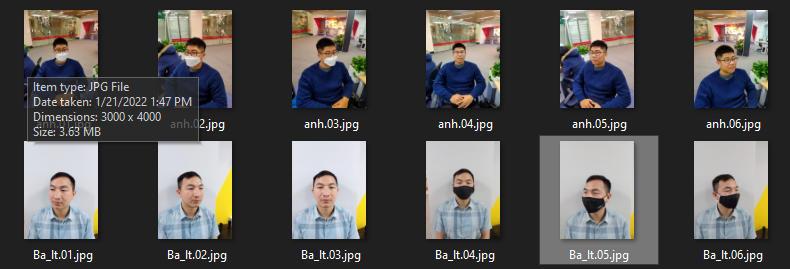

# face_masked_id
this is quick project about identifying people when wearing masks
# Requirements
- python 3.3+
- anaconda
# How to use
1. setup
```
requirements.txt
```
2. prepare your dataset
data folder
```
data/
  mask_nomask/
    id.01.jpg
    id.02.jpg
    ...
```


3. Run
```
python demo_video.py
```
